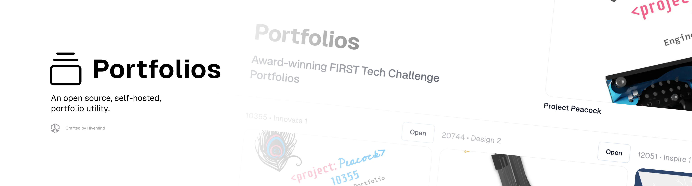

<strong>Portfolios</strong> is an open-source, self-hosted, portfolio utility for FIRST Tech Challenge teams. This enables teams to share their portfolios with the world. This project is
licensed under [GNU LGPLv3](COPYING.LESSER).

## Features

- **Easy-to-use interface**. Just one click away from the greatest portfolios
- **Accessible**. Follows the WCAG Accessibility Standards
- **High performance**. Built for static, dynamic updates are supported.
- **Free and open-source**. The code is free and open for anyone to audit and contribute to.

**Stack:**

- **Pocketbase** for easy database support, allowing anyone to easily set up a deployment!
- **Next.js**, a high-preformance scalable solution for static sites.
- **TailwindCSS** for easy style editing.
- **RadixUI** for accessible components

## Getting started

Simply fork this repository and deploy to Vercel or your preffered hosting provider. A few great ones are listed below.

**Hosting Solutions**:

- **Vercel** is easy, free, and flexible.
- **Hop** is cheap, has a generous free tier, and provides great scalable infrastructure.
- **Railway** is cheap, scalable, and has a great community.

**Database Solutions**:

- **Pockethost** is a free hosting provider for Pocketbase
- **Self-hosted Pocketbase** requires you to pay for a cloud service. You can run this on services like Hop, listed above!

**Setting up Environment Variables**

Once you have your host setup, you'll notice the frontend cannot deploy without some basic environment variables. You'll need to configure these environment variables inside your web-hosting provider.

Usually they will have an interface where you can paste your environment variables. See `env.example` to see the schema for your environment variables.

> Please note, you will need to include all environment variables for this site to function properly.

## Contributing

Contributing is always welcome, wether you want to add a portfolio, or a feature to the web client, we will usually accept most pull-requests!

**Want to add a portfolio?**

You can add your portfolio by submitting the form [found here](https://github.com/hivemindhq/portfolios/issues/new?assignees=&labels=addition&projects=&template=add_portfolio.yml&title=Portfolios+%C2%BB+), You are required to provide all fields. Your portfolio will then be queued for review, and then will be added shortly after.

---

Built with ❤️ by Hivemind Robotics
